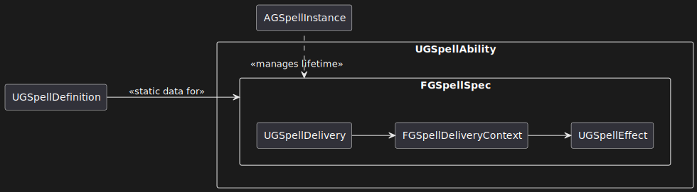
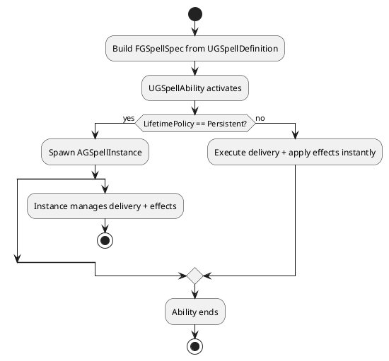

---
aliases:
  - Spell System Overview
tags:
  - design
  - spell_system
---
# Spell System Overview

The spell system in Ganymede is designed to be highly extensible and configurable through data, with composable *deliveries* and *effects*. It makes heavy use of Unreal's Gameplay Ability System (GAS), which supports the goal of proper network replication.

- **[Spell Ability](./SpellAbility.md)**: A generic GAS ability that casts spells
- **[Spell Definition](./SpellDefinition.md)**: Spells can be defined in data (as a data asset)
	- Casting costs
	- Delivery mechanism
	- Spell mappings
	- Spell effect
- **[Spell Spec](./SpellSpec.md)**: Spells can be configured during runtime
	- Randomized spell pickups
	- Player-tweaked settings
	- Modifiers
- **[Spell Delivery](./SpellDelivery.md)**: The mechanism for how the spell moves within the world
	- Gathers data and targets
	- Raycast, projectile grenade, aura around caster, etc.
- **[Spell Effect](./SpellEffect.md)**: The actual effects of the spell
	- Unique input parameters per effect
	- Can perform actions
		- Knock back targets, cancel targets' abilities, etc.
	- Can apply Gameplay Effects
		- Status.Stunned, Data.Damage, etc.
	- Can trigger Gameplay Cues
		- VFX, SFX
- **[Spell Instance](./SpellInstance.md)**: Manages the lifetime of persistent spells
	- Allows inter-spell communication
	- Takes control of a spell spec, allowing the original spell ability to end



> [!quote]- PlantUML Code
> ```plantuml
> @startuml
> 
> skinparam componentStyle rectangle
> left to right direction
> 
> component UGSpellDefinition
> component UGSpellAbility {
>     component FGSpellSpec {
>         component UGSpellDelivery
>         component FGSpellDeliveryContext
>         component UGSpellEffect
>     }
> }
> component AGSpellInstance
> 
> UGSpellDefinition --> FGSpellSpec : <<static data for>>
> UGSpellDelivery --> FGSpellDeliveryContext
> FGSpellDeliveryContext -->  UGSpellEffect
> FGSpellSpec <. AGSpellInstance : <<manages lifetime>>
> 
> @enduml
> ```



## Key Notes

### Mana Burn

When a player runs out of mana, spells will substitute health instead. This can allow players to use spells in a pinch, at the increasing danger of killing themselves. If a player dies to mana burn, their respawn timer should be longer, to prevent zerg rushing/other abuse.

Mana burn should be implemented as a gameplay effect applied to the source (caster) after an ability activates, rather than as a direct ability cost. This allows spells to still block activation if they want, by adding a non-zero direct mana cost.

### Spell Lifetimes

Some spells may have lifetimes that last a while (e.g. due to spawning actors, or deliveries that aren't one-shot). This does *not* include the ongoing effects from any spells that have already been applied.

When this occurs, the originating spell ability will spawn a spell instance actor, which takes control of the lifetime and management of the spell, allowing the ability itself to end early. This avoids the headache of carefully managing Ability lifetimes, and is more idiomatic in GAS.

Once spawned, spell instance actors are registered to a spell manager, which can allow coordination between multiple instances (such as destroying the oldest instance, or whatever other needs for cross-spell communication).

### [Spell Mappings](./SpellMapping.md)

Different delivery mechanisms can produce their own unique data and context which can be mapped to inputs for effects. For example, the radius of an aura around the caster could be plugged into the damage it does.

The types of data a delivery mechanism produces and an effect requires can vary a bit (vectors, floats, etc.). Spell mappings are designed to reasonably support most data types, and can apply configured operations on the data (scaling, clamping, etc.), or even custom curves/functions if supplied to the mapping. Mappings can also be configured to run separately per-target, rather than running once and applying the same data to each target.